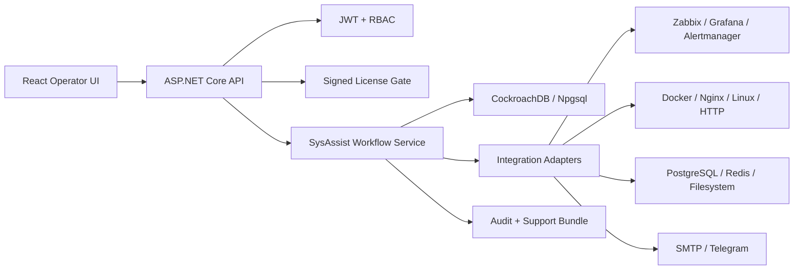

<p align="center">
  
</p>

<h1 align="center">SysAssist</h1>

<p align="center">
  Enterprise-grade IT incident coordination platform for monitoring, infrastructure, diagnostics, approvals, remediation actions, and audit.
</p>

<p align="center">
  <strong>.NET 9</strong> · <strong>React + Vite</strong> · <strong>CockroachDB</strong> · <strong>Encrypted Secrets</strong> · <strong>Signed Licensing</strong> · <strong>Production Readiness Gates</strong>
</p>

---

## What Is SysAssist?

SysAssist is not another monitoring system. It is an operational coordination layer that connects existing monitoring and infrastructure tools, normalizes events, recommends safe remediation, routes risky actions through approvals, records audit evidence, and exports support bundles.

The system is designed to look and behave like a real product:

- real database mode through CockroachDB/Npgsql;
- encrypted module secrets;
- signed license validation;
- role-based access control;
- production readiness gate;
- real adapter health diagnostics;
- Docker and server deployment artifacts;
- focused automated smoke checks.

## Product Capabilities

| Area | What SysAssist Provides |
| --- | --- |
| Dashboard | Operator view with incident intake, module health, readiness, queue state, and recent evidence. |
| Modules | Registry of built-in integrations with settings, masked secrets, health checks, polling, webhooks, and action catalogs. |
| Remediation | 65 remediation actions across 13 modules, with risk levels, approval rules, SafeMode, and execution audit. |
| Diagnostics | Real adapter health evidence, database connectivity, secret protection state, stale checks, module warnings, and remediation hints. |
| Security | JWT auth, RBAC policies, AES-GCM module secret encryption, rate limits, request size limits, security headers, and support-bundle redaction. |
| Licensing | ECDSA P-256 signed license validation with production blocking when invalid. |
| Audit | Login events, module checks, diagnostics, approvals, action execution, support exports, and correlation IDs. |
| Deployment | Local Docker lab, production Docker Compose stack, migration container, nginx examples, and Google Cloud Run samples. |

## Built-In Modules

SysAssist ships with 13 baseline modules:

1. Zabbix
2. Grafana
3. Prometheus Alertmanager
4. PostgreSQL
5. Redis
6. Docker
7. Nginx
8. Linux Host
9. HTTP Endpoint Checker
10. File System Monitor
11. SMTP Email
12. Telegram Bot
13. Local Rule Advisor

Every module has health status, connection settings, SafeMode, fallback controls, and at least five remediation actions.

## Architecture



Project layout:

| Path | Purpose |
| --- | --- |
| `src/SysAssist.Api` | ASP.NET Core endpoints, auth, CORS, rate limits, health, readiness, Swagger in Development. |
| `src/SysAssist.Application` | Application contracts and service interfaces. |
| `src/SysAssist.Contracts` | DTOs shared by API, tests, and UI clients. |
| `src/SysAssist.Domain` | Core entities and enums. |
| `src/SysAssist.Infrastructure` | EF Core, CockroachDB, adapters, security, licensing, seeding, and workflow implementation. |
| `src/SysAssist.Web` | React/Vite operator console. |
| `tests/SysAssist.Tests` | xUnit tests for security, workflow, modules, actions, support bundles, and diagnostics. |
| `deploy` | Docker, nginx, systemd, and Google Cloud deployment examples. |
| `scripts` | Smoke checks, production secret generation, and Telegram launcher bot. |
| `docs` | Architecture, security, production readiness, server deployment, demo, and module SDK notes. |

## Tech Stack

- Backend: C# 13, .NET 9, ASP.NET Core Minimal APIs
- Frontend: React 19, Vite 8, TypeScript, TanStack Query, Zustand, Recharts, Framer Motion, GSAP, Lucide
- Database: CockroachDB with EF Core and Npgsql
- Security: JWT Bearer, RBAC, AES-GCM secret protection, ECDSA license verification
- Observability: Serilog, audit log, health/readiness endpoints, diagnostics endpoint
- Packaging: Docker, Docker Compose, nginx, Cloud Run examples

## Quick Start

### 1. Clone And Configure

```powershell
git clone <repo-url> SysAssist
cd SysAssist
copy .env.example .env
```

Set these values in `.env` before real database mode:

```env
SysAssist__UseDemoData=false
SysAssist__BootstrapAdminPassword=<strong-admin-password>
Auth__JwtSecret=<long-random-secret>
Security__SecretEncryptionKey=<base64-32-byte-key>
Licensing__PublicKey=<signed-license-public-key>
Licensing__LicenseKey=<signed-license-token>
ConnectionStrings__SysAssistDb=Host=localhost;Port=26257;Database=sysassist;Username=root;Password=;SSL Mode=Disable
```

Generate local production-shaped secrets:

```powershell
scripts\generate-prod-secrets.ps1
```

### 2. Start Local Database

```powershell
docker compose up -d cockroachdb cockroach-init
```

### 3. Run API

```powershell
dotnet restore SysAssist.sln
dotnet run --project src/SysAssist.Api --urls http://localhost:5089
```

Health checks:

```text
GET http://localhost:5089/health/live
GET http://localhost:5089/health/ready
```

### 4. Run Web UI

```powershell
cd src/SysAssist.Web
npm install
npm run dev -- --host 127.0.0.1 --port 5173
```

Open:

```text
http://localhost:5173
```

Login:

```text
admin / value from SysAssist__BootstrapAdminPassword
```

## Docker Lab

The local lab starts CockroachDB, Redis, nginx demo endpoint, API, Web UI, and optional monitoring services.

```powershell
copy .env.example .env
docker compose up -d --build
```

Open:

| Service | URL |
| --- | --- |
| Web UI | `http://localhost:5173` |
| API | `http://localhost:5000` |
| Swagger | `http://localhost:5000/swagger` |
| Cockroach SQL UI | `http://localhost:8080` |
| nginx demo endpoint | `http://localhost:8088/health` |

Optional monitoring profile:

```powershell
docker compose --profile monitoring up -d
```

## Production Server Deployment

Production deployment uses:

- external CockroachDB/Cockroach Cloud;
- `.env.production` or a secret manager;
- one-shot `sysassist-migrate` container;
- API container with startup migrations disabled;
- Web container serving React and proxying `/api` to the internal API;
- optional nginx/systemd samples for VPS operation.

Fast path:

```bash
cp .env.production.example .env.production
# fill domain, CockroachDB, JWT, encryption, license, CORS, and bootstrap values

docker compose --env-file .env.production -f docker-compose.prod.yml build
docker compose --env-file .env.production -f docker-compose.prod.yml run --rm sysassist-migrate
docker compose --env-file .env.production -f docker-compose.prod.yml up -d sysassist-api sysassist-web
```

Then run:

```powershell
$env:SYSASSIST_SMOKE_ADMIN_PASSWORD = "<admin-password>"
scripts\prod-smoke.ps1 -ApiUrl https://sysassist.example.com -RequireProductionReadiness
```

Full deployment guide: [docs/server-deployment.md](docs/server-deployment.md)

Google Cloud Run samples: [deploy/google-cloud](deploy/google-cloud)

## Production Readiness Gate

SysAssist exposes an admin-only gate:

```text
GET /api/production-readiness
```

The gate returns `Ready` only when required production conditions pass:

- `ASPNETCORE_ENVIRONMENT=Production`
- demo data disabled;
- startup migrations disabled;
- explicit `AllowedHosts`;
- HTTPS CORS origins;
- strong JWT secret;
- module secret encryption key;
- valid license;
- healthy CockroachDB connection;
- fresh healthy diagnostics;
- enabled modules are healthy;
- fallback mode is off for enabled modules;
- SafeMode remains enabled.

Checklist: [docs/prod-readiness.md](docs/prod-readiness.md)

## Verification

Local verification commands:

```powershell
dotnet test SysAssist.sln --no-restore

cd src/SysAssist.Web
npm run build
```

End-to-end smoke:

```powershell
scripts\prod-smoke.ps1 -ApiUrl http://localhost:5089
```

The smoke script checks:

- readiness;
- login;
- dashboard counters;
- module registry;
- diagnostics run;
- production readiness endpoint;
- logs;
- support bundle export.

## Security Model

SysAssist is built with a conservative security posture:

- no default source-controlled production password;
- module secrets are encrypted with AES-GCM;
- secret DTOs return only masked values;
- support bundles exclude password hashes, license tokens, JWT keys, encryption keys, and raw module secrets;
- destructive actions are guarded by risk levels and approval workflow;
- SafeMode defaults to enabled;
- rate limits protect auth, webhooks, and write operations;
- production mode refuses weak critical configuration.

Security checklist: [docs/security-checklist.md](docs/security-checklist.md)

## Telegram Launcher Bot

For demos and local workstation operation, SysAssist includes an external Telegram launcher bot:

```powershell
powershell -ExecutionPolicy Bypass -File scripts\sysassist-telegram-bot.ps1
```

Commands include `/up`, `/status`, `/diagnostics`, `/modules`, `/actions`, and `/whoami`.

Guide: [docs/telegram-launcher-bot.md](docs/telegram-launcher-bot.md)

## Documentation

- [Architecture](docs/architecture.md)
- [Server deployment](docs/server-deployment.md)
- [Production readiness](docs/prod-readiness.md)
- [Security checklist](docs/security-checklist.md)
- [Module SDK](docs/modules-sdk.md)
- [Demo script](docs/demo-script.md)
- [Diploma notes](docs/DIPLOMA_NOTES.md)
- [Google Cloud deployment](deploy/google-cloud/README_DEPLOY_GCP.md)

## Current Production Notes

SysAssist is ready for a controlled demo and production-shaped server deployment. For a regulated enterprise launch, finish these hardening items:

- SSO/OIDC and refresh-token lifecycle;
- immutable external audit sink;
- WAF/IAP or private ingress;
- backup/restore drill for CockroachDB;
- provider-specific webhook signature validation per vendor;
- hosted scheduler with leases for background polling;
- secret rotation procedure for encrypted module settings.

## License

SysAssist includes its own runtime product license validation. Repository/source-code licensing should be defined separately before public distribution.
