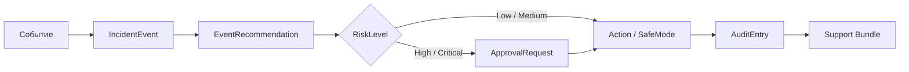
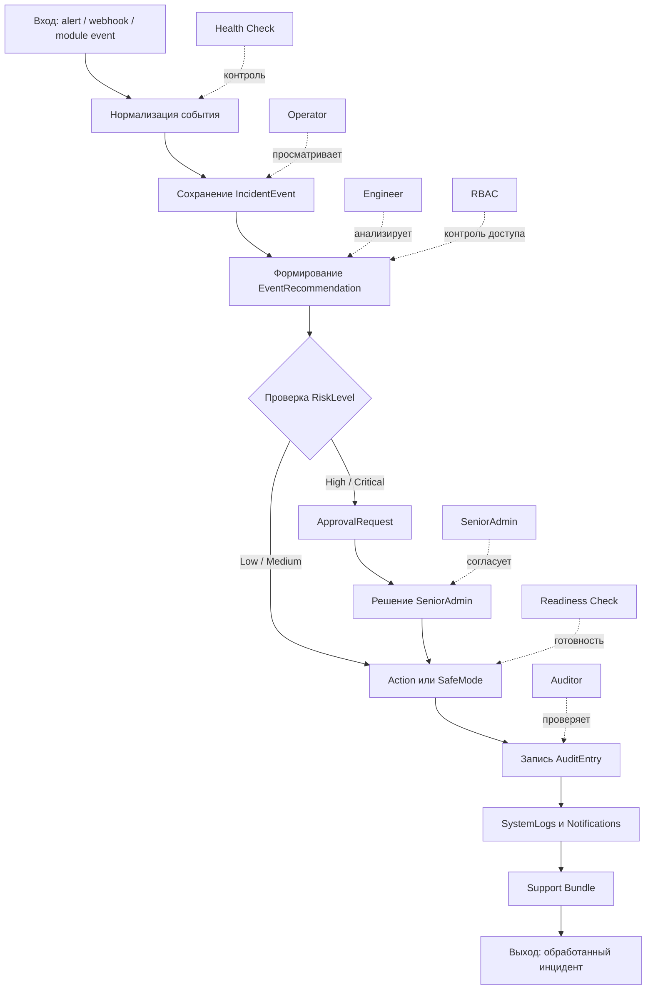
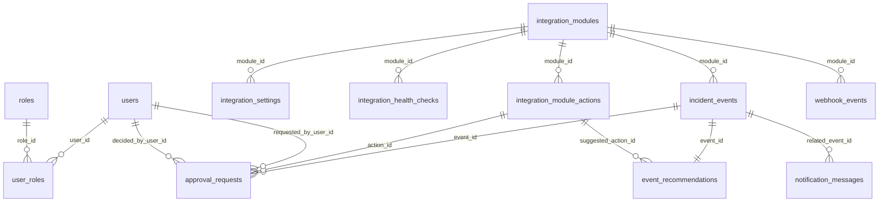
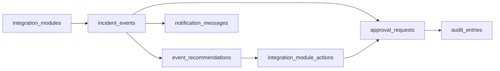
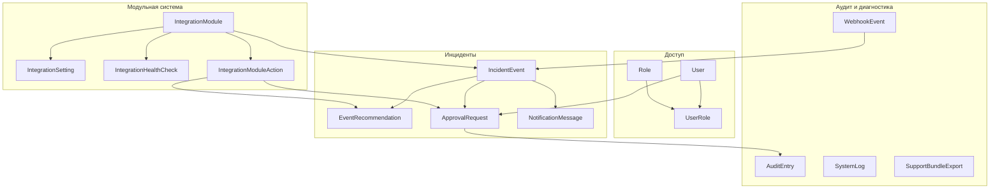
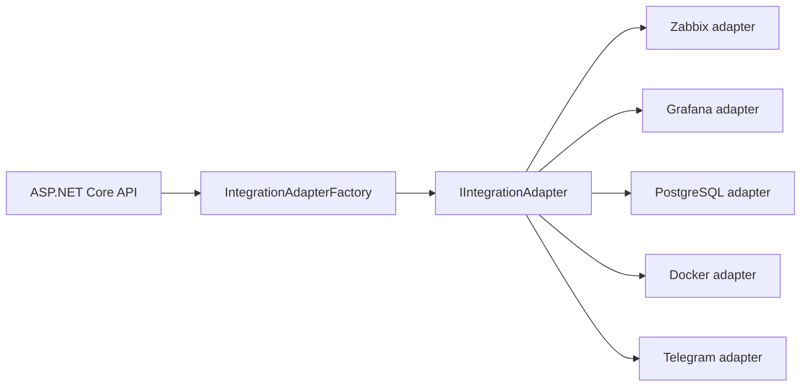
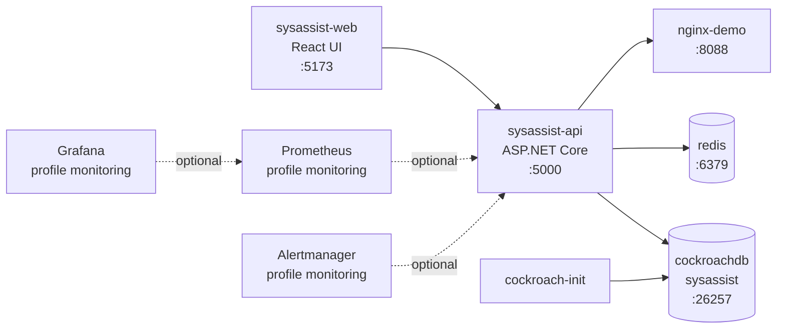

# SysAssist — презентация защиты проекта

> **Тема:** «Разработка программы для автоматизации и оптимизации работы системных администраторов средних и крупных предприятий»

**SysAssist** — веб-приложение для системных администраторов. Система принимает IT-события, сохраняет их как инциденты, формирует рекомендации, проверяет риск действия, запускает согласование, выполняет действие или SafeMode-сценарий и фиксирует результат в аудите.

Главная цепочка работы:



---

## 1. Что делает SysAssist

SysAssist объединяет работу администратора в один управляемый процесс:

| Блок | Что реализовано |
|---|---|
| Инциденты | Прием событий от модулей и webhook, сохранение в `incident_events` |
| Рекомендации | Формирование `event_recommendations` для события |
| Риск | Проверка уровня риска действия через `risk_level` |
| Согласование | Создание `approval_requests` для рискованных действий |
| Действия | Выполнение действия модулем или SafeMode-сценарий |
| Аудит | Запись результата в `audit_entries`, системные логи в `system_logs` |
| Диагностика | Health checks модулей и support bundle |

---

## 2. Реальные вставки работы

Используй эти места для слайдов и демонстрации. Скриншоты интерфейса можно положить рядом с этим документом в папку `screenshots`.

| Экран | Файл для вставки | Что показать |
|---|---|---|
| Dashboard | `screenshots/01_dashboard.png` | Сводка событий и состояния системы |
| Modules | `screenshots/02_modules.png` | Каталог модулей и их health status |
| Incident | `screenshots/03_incident.png` | Карточка события и рекомендация |
| Approvals | `screenshots/04_approvals.png` | Запрос на согласование рискованного действия |
| Audit | `screenshots/05_audit.png` | Журнал действий и результат обработки |
| Diagnostics | `screenshots/06_diagnostics.png` | Health checks, readiness и support bundle |

```md


```

---

## 3. ISO 9001 диаграмма процесса

Диаграмма показывает процессный подход: есть вход, обработка, ответственные роли, контрольные точки и выход.



---

## 4. Реальная ER-диаграмма базы данных

Диаграмма построена по `SysAssistDbContext`: таблицы, внешние ключи и связи, которые реально настроены в проекте.



### Что хранит база

| Группа | Таблицы |
|---|---|
| Доступ | `users`, `roles`, `user_roles` |
| Модули | `integration_modules`, `integration_settings`, `integration_health_checks`, `integration_module_actions` |
| Инциденты | `incident_events`, `event_recommendations`, `approval_requests` |
| Эксплуатация | `audit_entries`, `system_logs`, `notification_messages`, `webhook_events`, `support_bundle_exports` |

Главная рабочая цепочка данных:



---

## 5. Структура и отношения классов

Для презентации используется не перегруженная UML-схема, а понятная схема отношений основных классов backend.



---

## 6. Как реализовано ООП

### Инкапсуляция

Данные разделены по доменным сущностям: `User`, `Role`, `IntegrationModule`, `IncidentEvent`, `ApprovalRequest`, `AuditEntry`. Сервисный слой работает с объектами и DTO, не отдавая напрямую секреты и внутренние поля.

### Абстракция

Интеграции работают через общий контракт `IIntegrationAdapter`:

```csharp
public interface IIntegrationAdapter
{
    string ModuleKey { get; }
    Task<IntegrationHealthResult> CheckHealthAsync(CancellationToken ct);
    Task<IReadOnlyList<IncomingEventDto>> FetchEventsAsync(CancellationToken ct);
    Task<ActionExecutionResult> ExecuteActionAsync(ActionExecutionRequest request, CancellationToken ct);
}
```

### Полиморфизм

Разные адаптеры модулей реализуют один контракт. Backend вызывает `CheckHealthAsync`, `FetchEventsAsync` и `ExecuteActionAsync`, не привязываясь к конкретному модулю.



### Наследование и базовый адаптер

`BaseIntegrationAdapter` содержит общую логику проверки состояния модуля, fallback-режима, конфигурации, SafeMode и destructive actions. Конкретные адаптеры переопределяют реальную проверку, получение событий и выполнение действий.

```csharp
public abstract class BaseIntegrationAdapter : IIntegrationAdapter
{
    public abstract string ModuleKey { get; }

    public async Task<IntegrationHealthResult> CheckHealthAsync(CancellationToken ct)
    {
        var state = await SettingsReader.GetStateAsync(ModuleKey, ct);
        if (!state.IsEnabled)
            return new IntegrationHealthResult(ModuleKey, HealthStatus.Disabled, "Module is disabled.");

        return await CheckRealHealthAsync(state, ct);
    }

    protected virtual Task<IntegrationHealthResult> CheckRealHealthAsync(
        AdapterModuleState state,
        CancellationToken ct) =>
        Task.FromResult(new IntegrationHealthResult(ModuleKey, HealthStatus.NotConfigured, "No real health check."));
}
```

### Dependency Injection

Сервисы, адаптеры, DbContext, логирование, авторизация и security-сервисы подключаются через DI-контейнер. API не создает зависимости вручную, а получает готовые реализации.

---

## 7. Процесс работы события для видео

Сценарий демонстрации на 1–2 минуты.

| Шаг | Что показать | Что сказать |
|---:|---|---|
| 1 | Login | «Пользователь входит в SysAssist под своей ролью.» |
| 2 | Dashboard | «На dashboard видны события и состояние системы.» |
| 3 | IncidentEvent | «Событие сохраняется как IncidentEvent.» |
| 4 | Recommendation | «Система формирует рекомендацию по событию.» |
| 5 | RiskLevel | «Перед действием проверяется уровень риска.» |
| 6 | ApprovalRequest | «Рискованное действие отправляется на согласование.» |
| 7 | SeniorAdmin | «SeniorAdmin принимает решение.» |
| 8 | Action / SafeMode | «Действие выполняется или запускается в SafeMode.» |
| 9 | Audit Trail | «Результат фиксируется в AuditEntry.» |
| 10 | Support Bundle | «Для разбора формируется пакет поддержки.» |

Короткая фраза для видео:

> «SysAssist показывает полный путь события: от входящего alert до действия, согласования и записи результата в аудит.»

---

## 8. Docker: как поднимается и устанавливается

В проекте используется `docker-compose.yml`. Он поднимает базу данных, backend API, frontend и вспомогательные сервисы.

### Быстрый запуск из Git

```bash
git clone <repo-url> sysassist
cd sysassist
cp .env.example .env
# заполнить Auth__JwtSecret, Security__SecretEncryptionKey, Licensing__PublicKey, Licensing__LicenseKey
docker compose up -d --build
```

### Проверка

```bash
docker compose ps
docker compose logs -f sysassist-api
docker compose logs -f sysassist-web
```

### Остановка и перезапуск

```bash
docker compose restart
docker compose down
```

### Сервисы Docker Compose

| Сервис | Назначение | Порт |
|---|---|---:|
| `cockroachdb` | база данных CockroachDB | `26257`, `8080` |
| `cockroach-init` | создание базы `sysassist` | внутренний |
| `redis` | вспомогательный сервис | `6379` |
| `nginx-demo` | demo endpoint для проверок | `8088` |
| `sysassist-api` | backend API | `5000` |
| `sysassist-web` | frontend | `5173` |
| `prometheus` | мониторинг через профиль | `9090` |
| `grafana` | визуализация через профиль | `3000` |
| `alertmanager` | alertmanager через профиль | `9093` |

### Схема Docker-развертывания



---

## 9. Можно делать из Git

Проект запускается из репозитория по одной понятной цепочке:

```bash
git clone <repo-url> sysassist
cd sysassist
docker compose up -d --build
```

Для обновления:

```bash
git pull
docker compose up -d --build
```

Для проверки:

```bash
docker compose ps
curl http://localhost:5000/health
```

---

## 10. Что говорить на защите

**Коротко:**

> «SysAssist реализует управляемую обработку IT-инцидентов: событие поступает в систему, сохраняется в базе, получает рекомендацию, проходит проверку риска, при необходимости отправляется на согласование, а результат фиксируется в аудите.»

**Про базу:**

> «База хранит пользователей, роли, модули, настройки, health checks, события, рекомендации, согласования, аудит, логи, webhook-события, уведомления и support bundle. Связи настроены через EF Core в `SysAssistDbContext`.»

**Про ООП:**

> «ООП реализовано через доменные сущности, интерфейсы, базовые классы адаптеров, полиморфизм модулей и Dependency Injection. Разные модули подключаются через общий контракт `IIntegrationAdapter`.»

**Про Docker:**

> «Docker Compose поднимает CockroachDB, backend API, frontend и вспомогательные сервисы. База `sysassist` создается отдельным контейнером `cockroach-init`, backend подключается к CockroachDB через connection string, frontend обращается к API по `localhost:5000`.»
