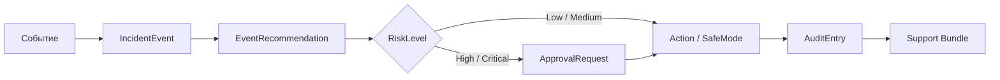
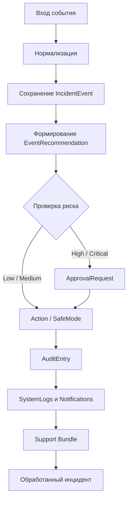
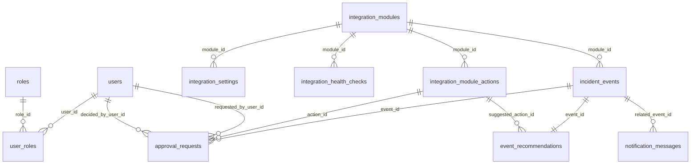
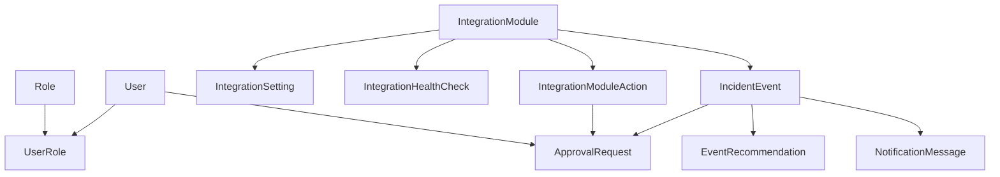

# SysAssist — презентация защиты проекта

> **Тема:** «Разработка программы для автоматизации и оптимизации работы системных администраторов средних и крупных предприятий»

**Описание:**
SysAssist — веб-приложение для системных администраторов. Система обрабатывает события, сохраняет их в базе, формирует рекомендации, проверяет риск, запускает согласование, выполняет действия и фиксирует результаты в аудите.

## 1. Скриншоты интерфейса


## 2. Главная цепочка событий


## 3. ISO 9001 — процесс обработки события


## 4. ER-диаграмма базы данных


## 5. Структура классов и ООП

- **Инкапсуляция:** внутренние поля скрыты, доступ через свойства и методы
- **Абстракция:** интеграции через `IIntegrationAdapter`
- **Полиморфизм:** разные адаптеры используют один интерфейс
- **Dependency Injection:** сервисы и адаптеры через DI

## 6. Процесс работы события (для видео)
1. Login → Dashboard
2. Поступление IncidentEvent → EventRecommendation
3. Проверка риска → ApprovalRequest при высоком риске
4. Action / SafeMode
5. AuditEntry → Support Bundle

## 7. Docker и Git
```bash
git clone <repo-url> sysassist
cd sysassist
cp .env.example .env
# заполнить переменные .env
docker compose up -d --build
```
Проверка:
```bash
docker compose ps
docker compose logs -f sysassist-api
```
Перезапуск / остановка:
```bash
docker compose restart
docker compose down
```
Обновление:
```bash
git pull
docker compose up -d --build
```
Проверка API:
```bash
curl http://localhost:5000/health
```

---
**Презентация готова для показа на защите.**