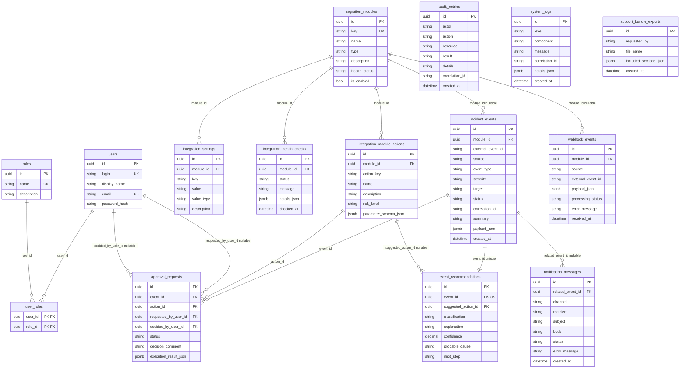
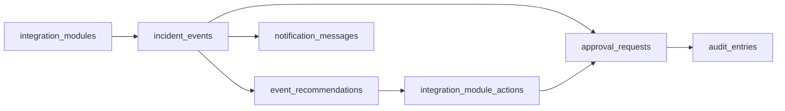

# ER-диаграмма базы данных SysAssist

Диаграмма построена строго по `src/SysAssist.Infrastructure/Data/SysAssistDbContext.cs`.

В ней отражены только реально настроенные таблицы, ключи, внешние ключи и связи из `OnModelCreating`.

## Реальные связи из DbContext

| Связь | Тип | Поведение удаления |
|---|---:|---|
| `users` → `user_roles` | 1:N | `Cascade` |
| `roles` → `user_roles` | 1:N | `Cascade` |
| `integration_modules` → `integration_settings` | 1:N | `Cascade` |
| `integration_modules` → `integration_health_checks` | 1:N | `Cascade` |
| `integration_modules` → `integration_module_actions` | 1:N | `Cascade` |
| `integration_modules` → `incident_events` | 1:N | `SetNull` |
| `incident_events` → `event_recommendations` | 1:1 | `Cascade` |
| `integration_module_actions` → `event_recommendations` | 1:N | `SetNull` |
| `incident_events` → `approval_requests` | 1:N | `Cascade` |
| `integration_module_actions` → `approval_requests` | 1:N | `Restrict` |
| `users` → `approval_requests.requested_by_user_id` | 1:N | `SetNull` |
| `users` → `approval_requests.decided_by_user_id` | 1:N | `SetNull` |
| `incident_events` → `notification_messages` | 1:N | `SetNull` |
| `integration_modules` → `webhook_events` | 1:N | `SetNull` |

## Индексы и ограничения

| Таблица | Индексы / ограничения |
|---|---|
| `users` | `login` unique, `email` unique |
| `roles` | `name` unique |
| `user_roles` | composite PK: `user_id + role_id` |
| `integration_modules` | `key` unique, `is_enabled`, `health_status` |
| `integration_settings` | unique: `module_id + key` |
| `integration_health_checks` | `module_id + checked_at` |
| `integration_module_actions` | unique: `module_id + action_key` |
| `incident_events` | `created_at`, `source`, `status`, `severity`, `correlation_id`, `external_event_id` |
| `event_recommendations` | `event_id` unique |
| `approval_requests` | `status`, `event_id` |
| `audit_entries` | `created_at`, `actor`, `correlation_id` |
| `system_logs` | `created_at`, `level`, `component`, `correlation_id` |
| `notification_messages` | `created_at`, `status` |
| `webhook_events` | `source`, `external_event_id`, `received_at` |
| `support_bundle_exports` | `created_at` |

## Главная рабочая цепочка данных

Важно: `audit_entries` в текущей реализации не имеет физического внешнего ключа на `approval_requests` или `incident_events`. Связь с процессом выполняется через поля `actor`, `action`, `resource`, `result`, `details` и `correlation_id`.
