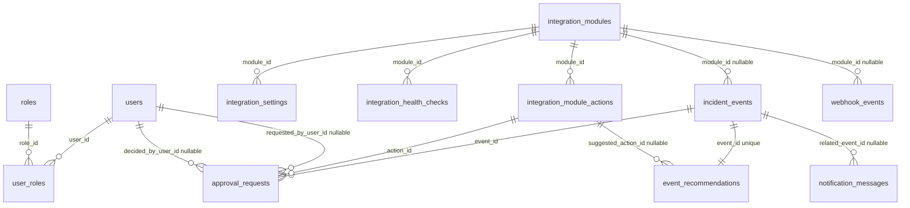

# ER-диаграмма базы данных SysAssist

Ниже представлена визуальная ER-диаграмма реальной базы данных SysAssist. Она отражает все реально реализованные таблицы и связи из `DbContext`.

В диаграмме показаны:
- Основные таблицы: `users`, `roles`, `user_roles`, `integration_modules`, `integration_settings`, `integration_health_checks`, `integration_module_actions`, `incident_events`, `event_recommendations`, `approval_requests`, `audit_entries`, `system_logs`, `notification_messages`, `webhook_events`, `support_bundle_exports`
- Все первичные и внешние ключи
- Основные связи 1:1, 1:N и N:M

Используется для презентации без текстового описания полей, только структура и связи между таблицами.

