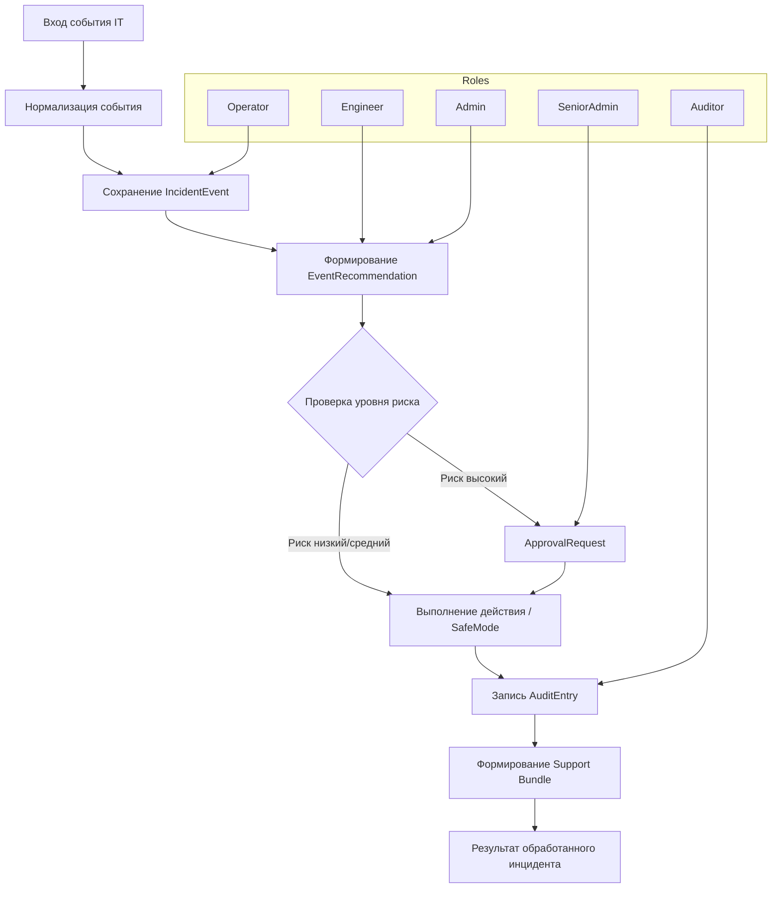

```mermaid
flowchart TD
    A[Вход события IT] --> B[Нормализация события]
    B --> C[Сохранение IncidentEvent]
    C --> D[Формирование EventRecommendation]
    D --> E{Проверка уровня риска}
    E -- Риск высокий --> F[ApprovalRequest]
    E -- Риск низкий/средний --> G[Выполнение действия / SafeMode]
    F --> G
    G --> H[Запись AuditEntry]
    H --> I[Формирование Support Bundle]
    I --> J[Результат обработанного инцидента]
    subgraph Roles
        O[Operator]
        EN[Engineer]
        SA[SeniorAdmin]
        AD[Admin]
        AU[Auditor]
    end
    O --> C
    EN --> D
    SA --> F
    AU --> H
    AD --> D
```