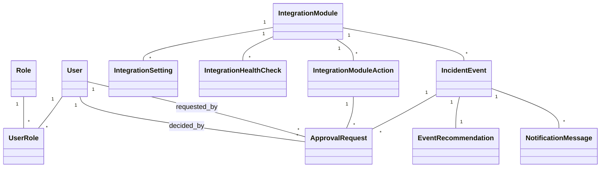

# SysAssist Git Presentation

Эта документация представляет проект **SysAssist** в виде презентации, отражая реальную реализацию.

## 1. Структура и отношения классов



*Диаграмма показывает реальные связи между классами в C# backend.*

## 2. Как реализовано ООП

- **Инкапсуляция:** классы скрывают поля, предоставляют свойства и методы для безопасного доступа.
- **Абстракция:** интерфейсы IIntegrationAdapter и сервисы скрывают детали реализации модулей.
- **Полиморфизм:** разные интеграционные модули реализуют общий интерфейс.
- **Композиция и DI:** все сервисы, DbContext и адаптеры подключаются через Dependency Injection.

Пример кода:
```csharp
public class IncidentService {
    private readonly IModuleAdapter _adapter;
    public IncidentService(IModuleAdapter adapter) { _adapter = adapter; }
    public Task HandleEventAsync(IncidentEvent evt) => _adapter.ProcessAsync(evt);
}
```

## 3. Процесс работы события (для видео)

1. Создание или получение `IncidentEvent`
2. Формирование `EventRecommendation`
3. Проверка риска
4. Если высокий риск → `ApprovalRequest`
5. Решение SeniorAdmin
6. Выполнение действия или симуляция (SafeMode)
7. Запись в `AuditEntry`
8. Генерация Support Bundle

## 4. Docker: поднятие и установка

```bash
# Клонирование и переход в директорию
git clone <repo-url> sysassist
cd sysassist

# Поднять Docker контейнеры
docker compose up -d --build

# Проверка работы
docker compose ps
docker compose logs -f

# Остановка и удаление контейнеров
docker compose down
```

- **Сервисы:** backend API, frontend, CockroachDB
- **Переменные окружения:** .env или docker-compose.override.yml
- **Порты:** backend 5000, frontend 5173, CockroachDB 26257

## 5. Можно делать из Git

- Клонировать репозиторий
- Сразу использовать инструкции Docker
- Легко запускать на любой машине с поддержкой Docker

*Конец документации презентации.*